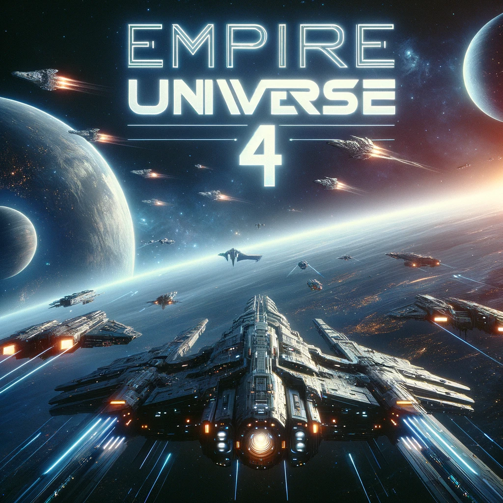

# Bienvenue dans Empire Universe 4 - Nouvelle Version



Empire Universe 4 est une version améliorée et repensée de notre jeu de stratégie en ligne basé dans l'espace. Cette nouvelle version est développée en utilisant ReactJS, offrant une expérience utilisateur plus fluide, des fonctionnalités améliorées et un design moderne.

### Table des matières
- [Apercu](#apercu)
- [Nouvelles fonctionnalités](#nouvelles-fonctionnalités)
- [Installation](#installation)
- [Lancement](#lancement)
- [Configuration](#configuration)
- [Comment jouer](#commentjouer)
- [Captures d'écran](#captures-d'écran)
- [Contributions](#contributions)
- [Licence](#licence)

## Apercu 
Empire Universe 4 est un jeu de stratégie en temps réel (RTS) dans un univers virtuel massivement multijoueur. Les joueurs sont plongés dans un univers spatial où ils peuvent :

Construire et gérer leur propre empire spatial.
Développer une flotte spatiale puissante.
Explorer de nouvelles planètes et systèmes solaires.
Former des alliances et négocier avec d'autres joueurs.
Participer à des guerres épiques et conquérir de nouvelles territoires.
Réaliser des quêtes et des missions pour gagner des récompenses.

## Nouvelles fonctionnalités
Dans cette version 4 d'Empire Universe, nous avons ajouté de nombreuses fonctionnalités passionnantes :

Interface Utilisateur Modernisée : Un tout nouveau design qui rend le jeu plus agréable visuellement et plus convivial.

Expérience Réactive : Utilisation de ReactJS pour une navigation fluide et une expérience utilisateur optimisée.

Nouvelles Planètes et Systèmes Solaires : Explorez de nouveaux mondes et découvrez des ressources précieuses.

Diplomatie Améliorée : Négociez des traités, formez des alliances et forgez des relations diplomatiques pour renforcer votre empire.

Améliorations de la Flotte Spatiale : De nouvelles classes de vaisseaux spatiaux et des options de personnalisation améliorées.

Événements en Temps Réel : Des événements aléatoires ajoutent du piquant au jeu et permettent de gagner des récompenses.

## Installation
Pour jouer à Empire Universe 4, suivez ces étapes d'installation :

Clonez ce repo github
```sh
git clone https://github.com/amauryfischer/eu4
```

installez les dépendances
```sh
yarn install
```

initialisez la base de donnée prisma
```sh
npx prisma migrate dev 
```

## Comment jouer
```sh
yarn run dev
```

## Configuration
TODO

## Captures d'écran
TODO


## Contributions
Nous accueillons les contributions de la communauté pour améliorer Empire Universe 4. Si vous souhaitez contribuer, veuillez consulter notre guide de contribution.

## Licence
Ce projet est sous licence MIT, ce qui signifie que vous pouvez l'utiliser, le modifier et le distribuer librement, tant que vous respectez les termes de la licence.